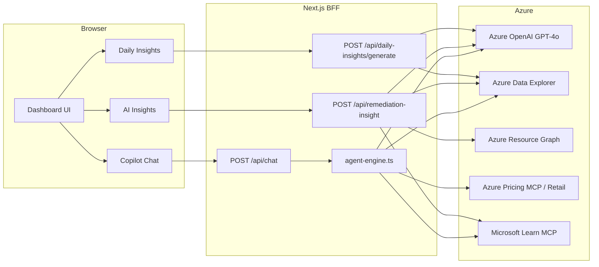

# FinOps Dashboard - AI Architecture and Azure Implementation Guide

## Overview

The FinOps Dashboard includes five intelligence capabilities:

- AI Chat with tool-calling loop
- Daily Insights report generation
- Remediation Impact insights enriched with Microsoft Learn (RAG)
- Agentic recommendation lifecycle classification
- Unified-collector Narrative IA generation for customer POCs

The runtime stack is Next.js 16 (BFF), Azure OpenAI GPT-4o, Azure Data Explorer (ADX), Azure Resource Graph,
and Azure Pricing endpoints/MCP integrations.

Authentication is based on DefaultAzureCredential for local and cloud execution.

## Logical Architecture

## Component 1 - AI Chat (Agentic Loop)

- Main route: `src/app/api/chat/route.ts`
- UI: `src/components/CopilotChat.tsx`
- Loop style: bounded tool-calling loop
- Max iterations in active route: 8

Two implementations exist:

- Active route (`route.ts`): ADX + direct Azure retail pricing lookup
- Full engine (`src/lib/agent-engine.ts`): ADX + Azure Pricing MCP + Microsoft Learn MCP

### Tooling

| Tool                      | Purpose                              |
| ------------------------- | ------------------------------------ |
| `execute_kql`             | Execute read-only ADX queries        |
| `get_azure_retail_prices` | Query prices.azure.com from route.ts |
| `azure_price_search`      | MCP price search                     |
| `azure_price_compare`     | MCP regional comparison              |
| `azure_region_recommend`  | MCP region recommendation            |
| `azure_ri_pricing`        | MCP RI scenario pricing              |
| `azure_bulk_estimate`     | MCP bulk estimate                    |
| `azure_sku_discovery`     | MCP SKU discovery                    |
| `search_microsoft_docs`   | Microsoft Learn context lookup       |

### Query Safety

KQL requests are validated as read-only. Mutation commands are blocked.
Large result sets are truncated before they are sent back to the model.

## Component 2 - Daily Insights (Single-Shot Generation)

- Main route: `src/app/api/daily-insights/generate/route.ts`
- UI page: `src/app/daily-insights/page.tsx`
- Storage: `.data/daily-insights/YYYY-MM-DD.json`

Execution model:

1. Return cached report if today's report already exists.
2. Run core KQL queries in parallel.
3. Build a structured prompt from query outputs.
4. Call GPT-4o once (no tool loop).
5. Persist and return markdown report.

## Component 3 - Remediation Impact Insights (RAG)

- Core logic: `src/lib/queries/remediation-impact.ts`
- API: `src/app/api/remediation-insight/route.ts`
- UI: `src/components/RemediationCard.tsx`
- Hook: `src/hooks/useRemediationImpact.ts`

This flow combines:

- Azure Advisor recommendation data (Resource Graph)
- Contract-aware cost estimation chain
- Microsoft Learn documentation retrieval
- GPT-4o JSON analysis output

### Cost Estimation Chain

1. Price Sheet data in ADX (preferred)
2. Azure Pricing MCP
3. Retail pricing API fallback
4. Heuristic fallback

### Currency Handling

Advisor savings are reported in USD. The platform converts values to the contract billing currency using ADX
pricing signals and applies one consistent currency across KPI cards and recommendation details.

### AI Output Shape

Insight output includes:

- Downtime risk
- Confidence score and confidence label
- Technical context warning
- Risk of non-remediation
- Source references (Microsoft Learn URLs)

## Component 4 - Agentic Recommendation Lifecycle

- Page: `src/app/agentic-finops/page.tsx`
- API: `src/app/api/agentic-finops/route.ts`
- Classifier: `src/lib/resource-graph-client.ts`

Lifecycle stages:

- Detect
- Analyze
- Decide
- Execute
- Validate
- Learn

Current production behavior is rule-based classification for recommendation stage, risk, and approval requirements.

## Component 5 - Customer Narrative IA

The approved customer POC uses the unified collector to gather the snapshot in
`input\customer\`. It is read-only, requires no tenant access, and runs with
PowerShell 7 plus Azure CLI locally or in Cloud Shell. Explicit
`SubscriptionIds` are required.

After ingestion, the pipeline:

1. Keeps raw and normalized identifiable evidence local.
2. Aggregates evidence into an allow-listed fact contract and rejects forbidden
   identifiers.
3. Attempts Cost Details automatically per subscription and month, with manual
   FOCUS fallback when needed.
4. Retrieves CAF/WAF grounding from Microsoft Learn MCP.
5. Sends Foundry only sanitized aggregates plus framework context.
6. Validates and persists the Narrative IA locally.

### Take Control narrative structure (schema `1.1.0`)

Each action carries the full Challenger sequence, not just a finding:

| Block       | Field(s)                                        |
| ----------- | ----------------------------------------------- |
| Insight     | `evidence[]`                                    |
| Impact      | `businessImpact`, `businessImpactDimension`     |
| Implication | `inactionRisk`, `inactionImpact`                |
| Recommendation | `recommendedChange`, `changeRisk`, `changeImpact` |
| Commitment  | `nextAction` (execution task), `commitment` (customer decision ask) |

The narrative closes with `executiveCommitment`, the single ask that ends the
conversation, alongside `decisionHeadline` and `executiveSummary`.

Two guardrails run before persistence and fail the generation when violated:

- **Quantified impact.** Every figure in `businessImpact` must be traceable to
  the sanitized fact contract (or a simple monthly/annual derivation of it,
  within 5% rounding tolerance). Integers up to 12 are treated as generic
  ordinals or time units. Purely qualitative impact is allowed per action, but at
  least one action in the narrative must cite a traceable measurement.
- **Take Control language.** `commitment` and `executiveCommitment` reject
  non-committal phrasing ("what do you think", "just a suggestion", "we could
  consider") and must be a question or open with "My recommendation is", "The
  suggested next step is", "Can we validate", or "Who should".

A rejected response is retried once with the rejection reason appended to the
prompt; the second failure is propagated and recorded as a failed narrative
status. Because the schema moved to `1.1.0`, narratives persisted under `1.0.0`
no longer validate — re-run customer ingestion after upgrading.

The Foundry payload excludes customer, resource, subscription, and
resource-group names; IDs; tags; and recommendation IDs. Microsoft Learn MCP
receives only non-identifying resource types and Advisor themes in CAF/WAF
documentation searches, never raw rows or identifiers. If grounding or
generation fails, the dataset is preserved, but ingestion exits non-zero and
records failed narrative status so the demo is blocked.

This is a point-in-time assessment. The UI uses the oldest source-file
last-modified timestamp as a conservative freshness proxy and marks it stale
after seven days. It does not claim that timestamp is the Azure capture time. It
cannot prove current configuration, runtime health, query completeness, or
remediation completion.

Azure Pricing, Cost Simulator, and execution history are not collection-driven;
they still depend on their own pricing, simulator, or app-history inputs.

## Authentication and Security

### Required Environment Variables

| Variable                   | Required                   | Description                                                   |
| -------------------------- | -------------------------- | ------------------------------------------------------------- |
| `AZURE_OPENAI_ENDPOINT`    | Yes                        | Azure OpenAI / Foundry endpoint                               |
| `AZURE_OPENAI_DEPLOYMENT`  | Yes                        | Model deployment name (for example: `model-router`, `gpt-4o`) |
| `AZURE_OPENAI_TENANT_ID`   | When cross-tenant          | Tenant that owns the Foundry resource                         |
| `AZURE_OPENAI_API_VERSION` | Optional                   | Defaults to `2025-04-01-preview`                              |
| `ADX_CLUSTER_URI`          | Yes (live mode)            | ADX cluster URI                                               |
| `ADX_DATABASE`             | Yes (live mode)            | ADX database name                                             |
| `AZURE_PRICING_MCP_URL`    | Optional                   | Azure Pricing MCP URL                                         |
| `AZURE_SUBSCRIPTION_ID`    | Required for Advisor flows | Subscription scope for Resource Graph                         |
| `NEXT_PUBLIC_USE_MOCK`     | Optional                   | Enables mock mode for UI/testing                              |

See `docs/configuration.md` for cross-tenant setup and model-router behaviour.

### Model invocation

All AI features go through `createChatCompletion()` in
`src/lib/openai-client.ts`. Do not call `client.chat.completions.create`
directly: the wrapper adds the reasoning-token headroom that keeps model-router
deployments from returning empty responses, and it normalizes parameters that
reasoning models reject. Validate a deployment with `npm run foundry:test`.

### Credential Model

- Local: `az login` + DefaultAzureCredential
- Cloud: Managed Identity + DefaultAzureCredential

No client secret is required for standard production deployment.

## Model Parameters

| Parameter         | Chat         | Daily Insights | Remediation Insight |
| ----------------- | ------------ | -------------- | ------------------- |
| `temperature`     | 0.3          | 0.3            | 0.3                 |
| `max_tokens`      | 4096         | 4096           | 400                 |
| `response_format` | default text | default text   | JSON object         |
| Iteration pattern | tool loop    | single call    | single call         |

## Azure AI Foundry Mapping

| Current Component               | Foundry Equivalent                 |
| ------------------------------- | ---------------------------------- |
| `openai-client.ts` direct calls | `AIProjectClient` calls            |
| Chat route + tools              | Foundry agent with function tools  |
| Daily insights generator        | Foundry thread/run flow            |
| Agent engine tools              | Foundry FunctionTool registrations |

## Suggested Azure Deployment Path

### Option A - Container Apps (recommended baseline)

1. Build a production image using Next.js standalone output.
2. Push image to Azure Container Registry.
3. Deploy to Azure Container Apps with user-assigned managed identity.
4. Assign least-privilege roles:
   - Cognitive Services OpenAI User
   - ADX database viewer access
   - Resource Graph read access as needed

### Option B - `azd` workflow

Use `azure.yaml` + Bicep/Terraform to provision and deploy in one repeatable flow.

## Operational Practices

- Enable structured logging for prompt/tool/response lifecycle.
- Keep model calls bounded by timeout and iteration limits.
- Track fallback rates (ADX unavailable, MCP fallback, heuristic fallback).
- Monitor data freshness for ADX and daily report cache.
- Re-run the unified collector before a POC and treat Narrative IA coverage
  limitations as part of the assessment.

## Known Implementation Notes

- The full tool set exists in `agent-engine.ts`; the active chat route currently uses a reduced tool set.
- Daily report content is cached per day to limit repeated model cost.
- Remediation insight confidence can be increased when high-quality Learn references are found.

## Troubleshooting

### AI chat returns no insights

- Verify Azure OpenAI variables are set.
- Verify identity permissions on Azure OpenAI.
- Check route logs for tool-call failures.

### ADX queries fail

- Validate `ADX_CLUSTER_URI` and `ADX_DATABASE`.
- Confirm viewer permissions on target database.
- Validate query syntax against current FinOps Hub schema.

### Remediation insight missing references

- Validate Microsoft Learn MCP connectivity.
- Confirm endpoint allow-list and network egress rules.

## References

- Azure AI Foundry documentation
- Azure OpenAI authentication with Microsoft Entra ID
- Azure Data Explorer RBAC
- Azure Container Apps managed identity
- FinOps toolkit open data guidance
